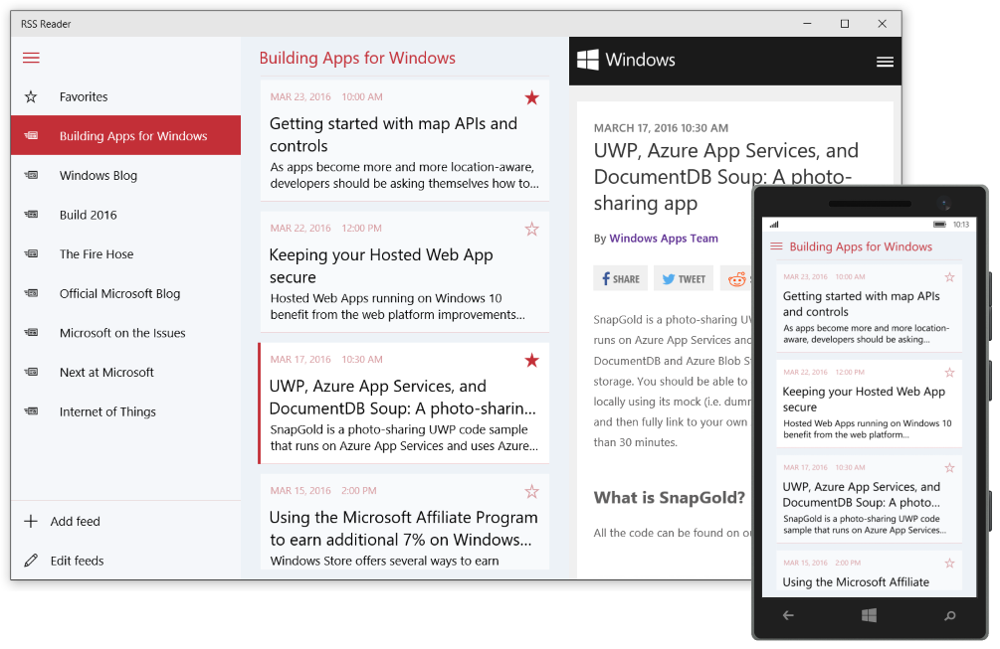

<!---
  category: Navigation Data ControlsLayoutAndText NetworkingAndWebServices FilesFoldersAndLibraries
-->

# RssReader sample

Preview version of the app Insider feed

## Features

**Note:** Features in this app are subject to change.

RssReader demonstrates:
	
* The navigation menu (hamburger menu) pattern and screen-width adaptivity using the 
  [SplitView](https://msdn.microsoft.com/library/windows/apps/windows.ui.xaml.controls.splitview.aspx) control and the 
  [AdaptiveTrigger](https://msdn.microsoft.com/library/windows/apps/windows.ui.xaml.adaptivetrigger.aspx) class.
* The Syndication APIs ([Windows.Web.Syndication](https://msdn.microsoft.com/library/windows/apps/windows.web.syndication.aspx)) 
  to retrieve RSS feed data. 
* The [DataContractSerializer](https://msdn.microsoft.com/library/windows/apps/system.runtime.serialization.datacontractserializer.aspx) class to save and 
restore app data from local storage.
* C# and XAML using the MVVM design pattern.

